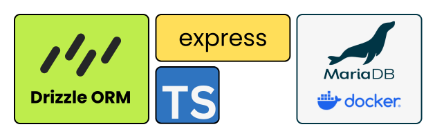

# Express with TypeScript, Drizzle ORM, and MariaDB (MySQL)

> Date: 2025-05-23

This is a walk through guide for setting up an Express Server using TypeScript and Drizzle. The MariaDB (MySQL) instance I used in this tutorial was running inside a docker container on Mac Silicon. I've included the `docker-compose.yml` if you want to spin it up yourself.

This is a bare bones setup. We will create two routes: getAllUsers and createUser.

## Download Starter App

This is an (optional) solution if you are already familiar with Drizzle. Clone the following repo: [Express-Drizzle-MariaDB-Starter](https://github.com/drjonesy/Drizzle-Express-TypeScript-MariaDB)

## Prerequisites

Before you begin, ensure you have the following installed:

- **Node.js**: [Download and Install Node.js](https://nodejs.org/en/download/) (recommended)
- **MariaDB**: [Use Docker Compose file](#docker-compose-mariadb-setup)
- **npm** or **Yarn**: Node.js comes with npm. If you prefer Yarn, [install it globally](https://yarnpkg.com/getting-started/install).

## Tutorial

> [!NOTE]
> I used Gemini with ChatGPT to help draft up the initial tutorial. I had to make multiple queries becuase the original draft was incorrect. The tutorial is excellent for someone not familiar with Drizzle.

### 1. Project Initialization

First, let's create a new project directory and initialize a Node.js project.

Create a new folder for your project and navigate into it:

```bash
mkdir api-express-drizzle
cd api-express-drizzle
```

Now, create a `package.json` file in the root of your project with the following content. This file defines your project's metadata, scripts, and dependencies.

```bash
npm init -y

# Make your scripts, dependencies, and devDependencies match the package.json below
```

> [!IMPORTANT]
> It is vital that you type this exactly. Mainly because version 5 of TypeScript is not stable at the time of this writing.

```json
# package.json
{
  "name": "api-express",
  "version": "1.0.0",
  "main": "index.js",
  "scripts": {
    "db:generate": "npx drizzle-kit generate",
    "db:migrate": "ts-node src/migrate.ts",
    "build": "tsc",
    "dev": "nodemon --watch src --ext ts --exec ts-node src/index.ts",
    "start": "ts-node src/index.ts"
  },
  "keywords": [],
  "author": "",
  "license": "ISC",
  "description": "",
  "dependencies": {
    "dotenv": "^16.5.0",
    "drizzle-orm": "^0.43.1",
    "express": "^4.19.2",
    "mysql2": "^3.14.1",
    "nodemon": "^3.1.10"
  },
  "devDependencies": {
    "@types/express": "^4.17.21",
    "@types/node": "^22.15.21",
    "drizzle-kit": "^0.31.1",
    "ts-node": "^10.9.2",
    "typescript": "^5.8.3"
  }
}
```

### 2. Install Dependencies

Next, we'll install all the necessary packages for Express, TypeScript, Drizzle, and MariaDB. Run the following command in your terminal:

```bash
npm install
# or if you use yarn
yarn install
```

This command will install all the packages listed under dependencies and devDependencies in your package.json file.

- `express`: The web framework.
- `typescript`: For static typing.
- `ts-node`: To run TypeScript files directly during development.
- `nodemon`: To automatically restart the server when file changes are detected during development.
- `dotenv`: To load environment variables from a .env file.
- `drizzle-orm`: The ORM itself.
- `drizzle-kit`: CLI for Drizzle migrations.
- `mysql2`: MariaDB/MySQL client for Node.js (Drizzle uses this under the hood for MariaDB).
- `@types/express`: TypeScript typings for Express.
- `@types/node`: TypeScript typings for Node.js.

### 3. Configure Environment Variables (`.env`)

Let's set up a `.env` file in the root of your project to store your database connection details. This keeps sensitive information out of your codebase and makes it easy to switch configurations between environments.

Create a file named `.env` and add the following content:

```bash
touch .env
```

```bash
# .env
DB_HOST=127.0.0.1
DB_PORT=3306
DB_USER=myuser
DB_PASSWORD=myuser1234
DB_NAME=mydb
```

Important: Replace `myuser`, `myuser1234`, and `mydb` with your actual MariaDB username, password, and database name. Ensure your MariaDB server is running and these credentials are correct.

### 4. Create App Directory (`./src`)

Now, let's create the `src` directory where all our app source code will reside.

```bash
mkdir src
```

### 5. Configure TypeScript (`./tsconfig`)

We need a `tsconfig.json` file to configure the TypeScript compiler. This file should be placed in the root of your project.

Create a file named `tsconfig.json` and add the following content:

```bash
touch tsconfig.json
```

```json
# tsconfig.json
{
  "compilerOptions": {
    "target": "es2021",
    "module": "commonjs",
    "rootDir": "./src",
    "outDir": "./dist",
    "esModuleInterop": true,
    "forceConsistentCasingInFileNames": true,
    "strict": true,
    "skipLibCheck": true
  },
  "include": ["src/**/*.ts"],
  "exclude": ["node_modules"]
}
```

This configuration tells the TypeScript compiler:

- `target`: To compile down to ES2021 JavaScript.
- `module`: To use CommonJS module system.
- `rootDir`: Where your TypeScript source files are located.
- `outDir`: Where the compiled JavaScript files will be placed.
- `esModuleInterop`: To enable compatibility for importing CommonJS modules.
- `forceConsistentCasingInFileNames`: To enforce consistent casing in file names.
- `strict`: To enable all strict type-checking options.
- `skipLibCheck`: To skip type checking of declaration files.
- `include`: Which files to include in the compilation.
- `exclude`: Which files to exclude from the compilation.

### 6. Drizzle Configuration (`./drizzle.config.ts`)

We need a `./drizzle.config.ts` file for Drizzle to know how to connect to our database and where to find our schema. This file should be placed in the root of your project.

Create a file named `drizzle.config.ts` and add the following content:

```bash
touch drizzle.config.ts
```

```ts
// drizzle.config.ts

import type { Config } from "drizzle-kit";
import * as dotenv from "dotenv";
dotenv.config();

export default {
  schema: "./src/schema.ts", // Path to your Drizzle schema file(s)
  out: "./drizzle", // Directory where Drizzle migrations will be generated
  dialect: "mysql", // Specify the database dialect (MariaDB is compatible with 'mysql')
  dbCredentials: {
    host: process.env.DB_HOST!,
    port: parseInt(process.env.DB_PORT!), // Parse port to a number
    user: process.env.DB_USER!,
    password: process.env.DB_PASSWORD!,
    database: process.env.DB_NAME!,
  },
} satisfies Config;
```

This configuration tells Drizzle:

- `schema`: Where to find your database schema definitions (we'll create this next).
- `out`: The directory where Drizzle will generate migration files.
- `dialect`: That we are using a MySQL-compatible database (MariaDB).
- `dbCredentials`: How to connect to your MariaDB database, pulling details from the `.env` file. The `!` operator asserts that the environment variables will be defined.

### 7. Database Connection and Drizzle Instance (`./src/db.ts`)

Now, let's create a file to establish our database connection and create our Drizzle ORM instance. This file will be responsible for connecting to MariaDB using `mysql2` and initializing Drizzle.

Create a file named `src/db.ts` and add the following content:

```bash
touch /src/db.ts
```

```ts
// db.ts

import { drizzle } from "drizzle-orm/mysql2";
import mysql from "mysql2/promise";
import * as dotenv from "dotenv";
import * as schema from "./schema"; // Import your schema definitions

dotenv.config();

const poolConnection = mysql.createPool({
  host: process.env.DB_HOST,
  port: parseInt(process.env.DB_PORT!),
  user: process.env.DB_USER,
  password: process.env.DB_PASSWORD,
  database: process.env.DB_NAME,
});

export const db = drizzle(poolConnection, { schema, mode: "default" });
```

This file:

Imports necessary modules: `drizzle` from `drizzle-orm/mysql2`, `mysql2/promise` for the MariaDB connection pool, `dotenv` for environment variables, and your Drizzle schema.

Loads environment variables using `dotenv.config()`.

Creates a MySQL connection pool using the credentials from your `.env` file.

Exports a `db` instance, which is your Drizzle ORM client, configured with the connection pool and your database schema.

### 8. Define Your Database Schema (`./src/schema.ts`)

Now, let's define our database tables using Drizzle's schema definition. This file will describe the structure of your database tables and their columns.

Create a file named `src/schema.ts` and add the following content:

```bash
touch /src/schema.ts
```

```ts
// schema.ts

import { mysqlTable, varchar, int, timestamp } from "drizzle-orm/mysql-core";

// Use 'int' instead of 'serial'.
// Serial is actually a reference to bigInt.
// Using serial often throws an error in TypeScript.
// But for an id: 'int' works fine.

export const users = mysqlTable("users", {
  id: int("id").autoincrement().primaryKey(),
  name: varchar("name", { length: 256 }).notNull(),
  email: varchar("email", { length: 256 }).unique().notNull(),
  age: int("age").notNull(),
  createdAt: timestamp("created_at").defaultNow(),
});

export type NewUser = typeof users.$inferInsert; // For inserting new users
export type User = typeof users.$inferSelect; // For selecting existing users
```

This file defines a `users` table with columns for `id`, `name`, `email`, `age`, and `createdAt`. It also exports TypeScript types (`NewUser` and `User`) that are inferred from your schema, which is very useful for type-safe database operations.

### 9. Run Drizzle Migrations (`./src/migrate.ts`)

Before we can interact with the database, we need to apply our schema changes to the MariaDB database. This involves generating migration files and then running them.

First, create a file named `src/migrate.ts` and add the following code. This script will use Drizzle's migrator to apply pending migrations.

```bash
mkdir /src/migrate.ts
```

```ts
// migrate.ts

import { migrate } from "drizzle-orm/mysql2/migrator";
import { db } from "./db"; // Import your Drizzle DB instance
import * as dotenv from "dotenv";

dotenv.config(); // Load environment variables

async function runMigrations() {
  try {
    console.log("Starting database migrations...");
    // Run migrations from the 'drizzle' folder
    await migrate(db, { migrationsFolder: "./drizzle" });
    console.log("Database migrations completed successfully!");
    process.exit(0); // Exit with success
  } catch (error) {
    console.error("Migration failed:", error);
    process.exit(1); // Exit with error
  }
}

runMigrations();
```

Next, you'll use the `db:generate` and `db:migrate` scripts defined in your package.json to manage migrations.

### 10. Generate Migration Files

Run this command whenever you make changes to your `src/schema.ts` file to generate new migration files in the `./drizzle` directory.

> [!NOTE]
> The latest version of Drizzle no longer supports appending :mysql - Instead it infers the database type. Old way: `npx drizzle-kit generate:mysql`

```bash
npm run db:generate
```

### 11. Apply Migrations to the Database

After generating migration files, run this command to apply them to your MariaDB database.

```bash
npm run db:migrate
```

### 12. Create Your Basic Express Server (`./src/index.ts`)

This will be the entry point for our Express application. Create a file named `src/index.ts` and add the following basic Express setup:

```bash
touch /src/index.ts
```

```ts
// index.ts | express server

import express from "express";
import dotenv from "dotenv";

// Load environment variables from .env file
dotenv.config();

const app = express();
const port = process.env.PORT || 3000; // Use port from .env or default to 3000

// Middleware to parse JSON bodies
app.use(express.json());

// Basic route
app.get("/", (req, res) => {
  res.send("Hello from Express with TypeScript!");
});

// Start the server
app.listen(port, () => {
  console.log(`Server is running on http://localhost:${port}`);
});
```

> [!NOTE]
> At this point you can run a basic Express Server but it won't create a user or show any existing users.

### 13. Creating User Controllers (`./src/controllers/UserController.ts`)

To organize our API logic, we'll create a `controllers` directory and define functions to handle user-related operations.

First, create the `controllers` directory inside `src`.

Next, create a file named `src/controllers/UserController.ts` and add the following code:

```bash
mkdir /src/controllers
touch /src/controllers/UserController.ts
```

```ts
// UserController.ts

import { Request, Response } from "express";
import { db } from "../db"; // Import the Drizzle DB instance
import { users, NewUser } from "../schema"; // Import the users schema and NewUser type
import { eq } from "drizzle-orm"; // Import 'eq' for equality comparisons in queries

// Import the ResultSetHeader type from mysql2/promise
// This is crucial for TypeScript to understand the insertId property returned from insert operations.
import { ResultSetHeader } from "mysql2/promise";

/**
 * @function getAllUsers
 * @description Fetches all users from the database.
 * @param {Request} req - The Express request object.
 * @param {Response} res - The Express response object.
 */
export const getAllUsers = async (req: Request, res: Response) => {
  try {
    // Use Drizzle's select method to retrieve all rows from the 'users' table.
    const allUsers = await db.select().from(users);
    // Send the fetched users as a JSON response.
    res.json(allUsers);
  } catch (error) {
    // Log the error for debugging purposes.
    console.error("Error fetching users:", error);
    // Send a 500 Internal Server Error response with a generic error message.
    res.status(500).json({ error: "Failed to fetch users" });
  }
};

/**
 * @function createUser
 * @description Creates a new user in the database.
 * @param {Request} req - The Express request object, expecting a JSON body with user data.
 * @param {Response} res - The Express response object.
 */
export const createUser = async (req: Request, res: Response) => {
  try {
    // Extract the new user data from the request body.
    // The `NewUser` type ensures type safety based on your Drizzle schema.
    const newUser: NewUser = req.body;

    // Basic validation: Check if required fields (name, email, age) are present and age is a number.
    if (!newUser.name || !newUser.email || typeof newUser.age !== "number") {
      // If validation fails, send a 400 Bad Request response.
      return res
        .status(400)
        .json({ error: "Name, email, and age are required." });
    }

    // Insert the new user into the 'users' table using Drizzle's insert method.
    // Drizzle's insert method returns an array of objects, where for MySQL, the first element
    // contains properties like `insertId` (the ID of the newly inserted row).
    const insertedUsers = await db.insert(users).values(newUser);

    // Assert the type of `insertedUsers` to `ResultSetHeader` to safely access `insertId`.
    // This is necessary because Drizzle's return type for `insert` can be generic,
    // and `mysql2` specific properties like `insertId` are part of `ResultSetHeader`.
    const { insertId } = insertedUsers as unknown as ResultSetHeader;

    // Send a 201 Created response along with a success message and the ID of the new user.
    res
      .status(201)
      .json({ message: "User created successfully", id: insertId });
  } catch (error: any) {
    // Log the error for debugging.
    console.error("Error creating user:", error);
    // Check for specific MySQL error code for duplicate entry (e.g., duplicate email).
    if (error.code === "ER_DUP_ENTRY") {
      // If a duplicate entry error occurs, send a 409 Conflict response.
      res.status(409).json({ error: "User with this email already exists." });
    } else {
      // For any other errors, send a 500 Internal Server Error response.
      res.status(500).json({ error: "Failed to create user" });
    }
  }
};
```

**Explanation of Functions:**

`getAllUsers`:

This asynchronous function handles `GET` requests to retrieve all user records.

It uses `db.select().from(users)` to build a Drizzle query that selects all columns from the `users` table.

The `await` keyword ensures the database operation completes before proceeding.

Finally, it sends the fetched `allUsers` array as a JSON response.

Includes basic error handling to catch and log any database query failures.

`createUser`:

This asynchronous function handles `POST` requests to add a new user.

It expects user data (name, email, age) in the request body, which is type-checked against `NewUser`.

**Validation**: It performs a basic check to ensure `name`, `email`, and `age` are provided and `age` is a number. If not, it sends a `400 Bad Request` error.

**Insertion**: `db.insert(users).values(newUser)` inserts the new user data into the `users` table.

`insertId`: For MySQL, Drizzle's `insert` operation returns a `ResultSetHeader` which contains the `insertId` of the newly created row. We use `as unknown as ResultSetHeader` to assert its type and extract the `insertId`.

**Response**: On successful creation, it sends a `201 Created` status with a success message and the `id` of the new user.

**Error Handling**: It includes specific error handling for `ER_DUP_ENTRY` (MySQL error code for duplicate unique key, like email), sending a `409 Conflict` status. Other errors result in a `500 Internal Server Error`.

### 14. Create User Routes (`./src/routes/UserRoutes.ts`)

To further organize our API, we'll create a dedicated routes file for user-related endpoints. This file will define the paths and link them to the appropriate controller functions.

First, create the `routes` directory inside `src`.
Next, create a file named `src/routes/UserRoutes.ts`

```bash
mkdir /src/routes
touch /src/routes/UserRoutes.ts
```

Add the following code:

```ts
// UserRoutes.ts

import { Router } from "express"; // This imports the Router class from 'express'
import { getAllUsers, createUser } from "../controllers/userController"; // Import the user controller functions

// This line initializes an actual instance of an Express Router.
// A Router instance is a complete middleware and routing system.
const router = Router();

// Define a GET route for '/users'. When a GET request comes to '/users',
// the `getAllUsers` function from `userController` will be executed.
router.get("/", getAllUsers);

// Define a POST route for '/users'. When a POST request comes to '/users',
// the `createUser` function from `userController` will be executed.
router.post("/", createUser);

// We export this configured router instance as the default export.
// This allows `src/index.ts` to easily import and use these routes.
export default router;
```

This file sets up an Express Router specific to user-related operations. It imports the `getAllUsers` and `createUser` functions from the `UserController` and assigns them to the respective `GET` and `POST` routes.

### 15. Updating Express Server with Routes (`./src/index.ts`)

Now, let's update our main Express application file (`src/index.ts`) to import and use the new `userRoutes` router. This will centralize our user-related API endpoints under a common base path.

Update your `src/index.ts` file with the following content:

```ts
import express from "express";
import dotenv from "dotenv";
import UserRoutes from "./routes/UserRoutes"; // Import the user routes

// Load environment variables from .env file
dotenv.config();

const app = express();
const port = process.env.PORT || 3000; // Use port from .env or default to 3000

// Middleware to parse JSON bodies
app.use(express.json());

// Basic route
app.get("/", (req, res) => {
  res.send("Hello from Express with TypeScript!");
});

// Use the user routes for any requests starting with '/users'
app.use("/users", UserRoutes);

// Start the server
app.listen(port, () => {
  console.log(`Server is running on http://localhost:${port}`);
});
```

We've made a key change here:

- `app.use('/users', UserRoutes);`: This line tells Express to use the `UserRoutes` router for any requests that start with `/users`. This means that `GET /users` will hit `router.get('/')` in `UserRoutes.ts`, and POST /users will hit `router.post('/')` in `UserRoutes.ts`. This modularizes your routing.

### 16. Running the Server

Finally, let's run our Express server in development mode. This will start the server and automatically restart it whenever you make changes to your source code, thanks to `nodemon`.

```bash
npm run dev
```

You should see output indicating that the server is running, typically on `http://localhost:3000`.

### 17. Testing the API

You can test your API using tools like cURL, Postman, or Insomnia. For this example, we'll focus on using Insomnia.

First, ensure your Express server is running (from Step 16).

**Test the** `POST /users` **Endpoint (Create User)**

1. **Open Insomnia**.
2. Create a **New Request**.
3. Set the method to `POST`.
4. Set the URL to `http://localhost:3000/users`.
5. Go to the Body tab and select `JSON` from the dropdown.
6. Enter the following JSON in the body:

```json
{
  "name": "John Doe",
  "email": "john.doe@example.com",
  "age": 30
}
```

7. Click **Send**.
8. You should receive a `201 Created` response with a message like `{ "message": "User created successfully", "id": 1 }`.

**Test the** `GET /users` **Endpoint (Get All Users)**

1. In Insomnia, create another **New Request**.
2. Set the method to `GET`.
3. Set the URL to `http://localhost:3000/users`.
4. Click **Send**.
5. You should receive a `200 OK` response with a JSON array containing the user(s) you've created:

```json
[
  {
    "id": 1,
    "name": "John Doe",
    "email": "john.doe@example.com",
    "age": 30,
    "created_at": "2024-05-23T18:00:00.000Z" // Timestamp will vary
  }
]
```

## Docker Compose (MariaDB Setup)

To spin up a local MariaDB database for this project. I've created a `docker-compose.yml` file. I've pre-configured the username, password, and database name. It also comes with an instance of phpMyAdmin if you want a GUI to access the databases.

In your `terminal/cmd/powershell` - run:

```bash
# first run
docker compose up --build
# cancel once it's running: This will give the 'myuser' privelges to the database.

# then run
docker compose up -d

# or just restart the container in Docker Desktop
```

```bash
# phpMyAdmin login
user: myuser
pass: myuser1234
```

```yml
# Docker Compose File

# First run the following command. Once it is running. Cancel it.
# docker compose up --build
# Then run...
# docker compose up -d   or restart the solution in docker desktop
services:
  mariadb:
    image: mariadb:10.11.10-jammy
    restart: always
    environment:
      MYSQL_ROOT_PASSWORD: example_root_password
      MYSQL_DATABASE: mydb
      MYSQL_USER: myuser
      MYSQL_PASSWORD: myuser1234
    ports:
      - "3306:3306"
    volumes:
      - ./mariadb_data:/var/lib/mysql

  phpmyadmin:
    image: phpmyadmin/phpmyadmin
    restart: always
    environment:
      PMA_HOST: mariadb
      # PMA_USER: pmauser | use the mysql user and pass
      # PMA_PASSWORD: pma1234
    ports:
      - "8080:80"
    depends_on:
      - mariadb
```
