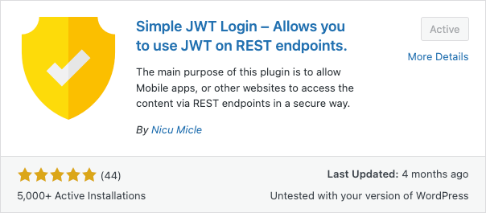

# Simple JWT Login (Plugin) - Tutorial


Files and instruction for navigating through the setup and testing of the WordPress (plugin) Simple JWT Login.

> Official Documentation: https://simplejwtlogin.com/docs/

> This tutorial is running a Docker instance of WordPress using the `docker-compose.yml` file included in this directory.

## Requirements

All of the following tools are using the FREE versions.

|                                                             |                                                                                                     |
| ----------------------------------------------------------- | --------------------------------------------------------------------------------------------------- |
|   | [Docker](https://www.docker.com/) - Installed with Docker Engine. (Free Docker Account Recommended) |
|  | [Postman](https://www.postman.com/) - Installed. (Free Postman Account Recommended)                 |
|   | [VS Code](https://code.visualstudio.com/) - Installed.                                              |

## Watch

- You can watch the full video series on YouTube at: https://youtube.com/...

## Tutorial

1. Create a new directory

   ```sh
    # example
    mkdir wp_simple_jwt_login
   ```

2. Downlod the `docker-compose.yml` file and save it in this new directory

3. Before running docker compose, make sure Docker is running.

4. Either use your terminal or VS Code. For this example I will use VS Code.

5. Using VS Code or your terminal load the directory with the `docker-compose.yml`.

6. Change any of the ports if you already have apps or the ports being used.

   ```yml
   # Example, change the 6060 or 3406.
   # The defualt port for phpMyAdmin and MySQL is 3306
   # WordPress is often on 80.
   # But for testing I like to place them on non-common ports for my local system.

   wordpress:
   ports:
       - "6060:80"
   phpmyadmin:
   ports:
       - "3406:80"
   ```

7. In same directory as the `docker-compose.yml` in a terminal. Run the docker compose command:

   ```sh
   docker compose up -d
   ```

8. Once your containers are up and running. The next step is to go through the basic WordPress setup. This tutorial is using a local test environment and not a production/live environment. Meaning I set my local admin info to something simple and non-secure, but only for a local test environment and not for a production/live environment.

   |              |                 |
   | ------------ | --------------- |
   | **email**    | admin@admin.com |
   | **username** | admin           |
   | **password** | admin1          |

9. The next step is to log into your `WordPress Dashboard` and navigate to the `Plugins` tab and select `Add New Plugin`

10. In the search bar type: `Simple JWT Login`

    

11. In the results select the `Simple JWT Login` plugin, Click the `install` button and when it changes to `activate` click it again to active/enable the plugin.

12.

## Generate Secure Keys for RS256 Decryption Algorithm

Generate the following keys in order. This example was run on a `MacOSX M2 device`.
I've included pre-generated sample keys if you'd like to just copy and paste these for local unsecure testing.

```sh
# Generate (Private) Key: Run Command

openssl genrsa -out private.key 2048
```

```sh
# Generate (Public) Key: Run Command

openssl rsa -in private.key -pubout -out public.key
```
